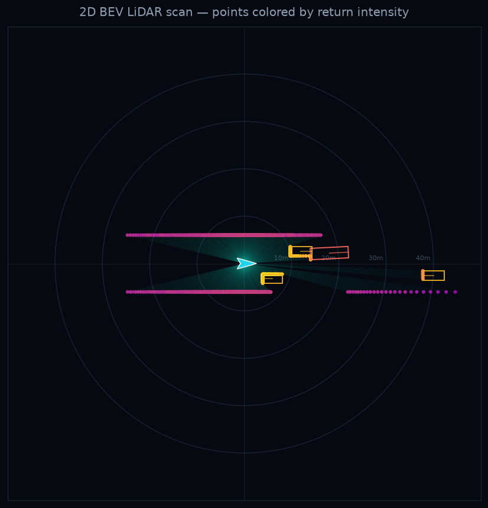

# BEV LiDAR + Traffic Simulator

A from-scratch 2D autonomous-driving simulator and research sandbox in two
tightly coupled parts:

1. **A 2D bird's-eye-view LiDAR sensor** — a spinning sensor fires rays in a
   full 360° circle against a scene of 2D polygons; each ray stops at the first
   surface it hits, so occlusion and shadows fall out for free. Every return
   also carries an **intensity** (surface reflectivity attenuated with range),
   so stop signs glow and concrete curbs stay dim. This is a useful qualitative
   signal model, not a calibrated reproduction of a production LiDAR.
2. **A path-based city traffic microsimulator** — the default environment is a
   seeded 4×4 intersection district with nine city blocks, generated
   buildings, parked cars, trees, signals, all-way stops, and route-based
   traffic. Cars follow the Intelligent Driver Model, choose connected routes,
   and travel through smooth intersection connectors. The ego's live LiDAR
   view is rendered below the street so you can compare the city with what the
   car senses.


## Research scope

The simulator is deliberately small and inspectable. It is best viewed as a
fast **planar BEV research kernel** for experiments where occlusion, exact
ground truth, traffic interaction, and controlled distribution shifts matter.
It is not currently a replacement for a 3D, physics-based AV simulator.

Strong fits for the current abstraction include:

- temporal occupancy, visibility, and occlusion reasoning;
- intersection decision-making under partial observability;
- controlled sensor-degradation and domain-shift studies;
- cooperative or federated learning experiments; and
- parameterized rare-event and planner stress testing.

Important current limitations are:

- **2D geometry and one planar return per azimuth** — no elevation channels,
  ground returns, object height, or 3D bounding boxes;
- **instantaneous sweeps** — no per-beam timestamps, ego-motion distortion,
  rolling scan, or sensor latency;
- **simple intensity/noise** — no incidence-angle, material calibration,
  multi-return, or weather physics;
- **one grid topology and limited actors** — seeds vary buildings, parked
  vehicles, traffic, and routes, but the road grid is not configurable yet and
  there are no pedestrians, cyclists, or lane changes;
- **script-oriented execution** — no standardized reset/action/observation
  API, episode recorder, benchmark metrics, or collision engine yet; and
- **longitudinal-only manual ego control** — steering remains path-following.

These limits do not prevent useful algorithmic research. The project is
intentionally staying 2D so large batches remain practical on lightweight
machines; claims about production automotive sensors should be limited
accordingly.

## Run the driving sim

```bash
python drive.py                       # generated city + ego LiDAR
python drive.py --no-lidar            # city street view only
python drive.py --scenario arterial   # original straight-road environment
python drive.py --save out.gif --seconds 20   # headless city GIF
```

After installing the package, the equivalent console command is `bev-drive`.
Both live panels are north-up: the map and LiDAR returns stay in a fixed world
orientation while the cyan ego marker turns with the vehicle.

The live window runs on **pygame at 60 fps**; GIF export renders headless
(no window) through the exact same code path and takes seconds.

Keys in the live window: `space` pause · `b` toggle ground-truth boxes ·
`r` toggle laser rays · `m` take the wheel (throttle `↑` / brake `↓`;
the ego steers itself along its lane) · `esc` quit.

## Run just the LiDAR sensor



```bash
python demo.py              # single frame  -> outputs/bev_frame.png
python demo.py --rays       # single frame with laser rays drawn
python demo.py --animate    # moving scene  -> outputs/bev_scan.gif
```

After installing the package, the equivalent console command is `bev-demo`.

## Why this is relevant to autonomous driving

Bird's-eye view is a common representation in AV perception and planning:
LiDAR pipelines can rasterize point clouds into top-down grids before applying
learned or classical models. This project builds a planar version of that
world from the sensor up. Because the simulator knows every object's true pose,
it contains the latent state needed to export exact boxes, identities, and
trajectories—and to derive visibility labels—without manual annotation.

The useful research opportunity is control: traffic state can be held fixed
while LiDAR configuration and noise vary. With a procedural scenario layer,
scene layout, occluders, and actor distributions could also be varied
independently. That makes it possible to isolate why an algorithm fails instead
of only measuring that it failed.

## Setup

```bash
python -m venv .venv && source .venv/bin/activate
pip install -e .
python -m unittest discover -s tests -v
```

## Files

| Path | Role |
|------|------|
| `src/bev_lidar_sim/sensors/` | `scene.py`: `Box` + `Scene`, everything becomes line segments with per-surface reflectivity. `lidar.py`: `Lidar2D` — vectorized ray/segment intersection, nearest hit, range noise, dropout, intensity channel |
| `src/bev_lidar_sim/maps/` | `roadgraph.py`: neutral map schema (nodes / lanes / connectors) with JSON round-trip; the seam for future SUMO-netconvert / Waymo-map importers |
| `src/bev_lidar_sim/sim/` | `traffic.py`: `Path`, `Vehicle`, IDM, signals, all-way stops, and the scenario-independent simulator core. `city/`: default 4×4 city — `graph.py` emits the grid `RoadGraph`, `world.py` builds seeded blocks/parked cars, `simulator.py` runs traffic on any `RoadGraph`. `arterial.py`: the original straight-arterial scenario |
| `src/bev_lidar_sim/render/` | `live.py`: pygame ego-following city/arterial view + north-up ego LiDAR panel. `stills.py`: matplotlib BEV rendering for publication stills |
| `src/bev_lidar_sim/cli/` | `drive.py` (driving sim) and `demo.py` (static LiDAR demo) CLI implementations |
| `tests/` | Lane-graph, connector, determinism, schema round-trip, and LiDAR checks |
| `drive.py`, `demo.py` | Thin root wrappers for the old commands |
| `assets/` | README/demo images and GIFs |

## How the driving behaves

Every lane and intersection movement is a **path** (a polyline with arc-length
lookup), so all driving logic stays 1-D: a vehicle is `(path, u, v)` and only
rendering and sensing care about x/y. The city connects 80 directed lane
segments into a graph. Each moving vehicle receives an inbound street, an
outbound destination, and a route through the graph; the ego receives a new
multi-block destination after finishing each trip.

Vehicles drive with the **Intelligent Driver Model (IDM)**, the standard
car-following model: accelerate toward a desired speed, brake to keep a safe,
speed-dependent gap to whatever is ahead — where "ahead" looks across path
transitions, so a car follows smoothly through a turn. Traffic controls are
handled the way real microsimulators do it: a red light or an un-granted stop
line becomes a *virtual stopped car* at the line, so the same IDM code that
follows the lead vehicle also produces smooth stops at signals.

On top of that:

- **Generated city blocks**: nine blocks contain varied building footprints,
  alleys, sidewalk trees, parked vehicles, curbs, crossings, and road paint.
- **Signal phases**: east/west green → yellow → all-red → north/south green →
  …; this first city version permits straight movements at signals and routes
  turns through serialized all-way stops to avoid conflicting paths.
- **Yellow-light dilemma**: a car runs the yellow only when it can no longer
  stop comfortably before the line.
- **All-way stop**: come to a full stop to join the queue; proceed when the
  intersection box is clear and it's your turn (first-come, first-served).
- **Routes and turns**: traffic drives between random city boundaries using
  straight, right, and protected left connectors, slowing before curves and
  displaying direction-appropriate turn signals.
- **Local rendering and sensing**: the camera follows the ego in both x and y;
  LiDAR only receives nearby geometry, keeping the larger map inexpensive.

## How the sensor works

Each beam is a ray `O + t·d`. For a segment `A → B` we solve for the ray
parameter `t` and segment parameter `u` with 2D cross products:

```
t = (A − O) × e / (d × e)      u = (A − O) × d / (d × e)      e = B − A
```

A hit is valid when `t > 0` and `0 ≤ u ≤ 1`; the smallest valid `t` across all
segments is the measured range. All beams × all segments are computed in one
broadcast, so a full sweep is a couple of numpy operations. The winning
segment's reflectivity, attenuated by `exp(-r/55)` plus noise, becomes the
return intensity.

## Research directions

| Project | Core experiment | Upgrades needed |
|---|---|---|
| **Occlusion-aware occupancy and flow** | Predict current and future occupancy, including road users hidden behind vehicles or buildings, from a sequence of scans | Timestamped episode recording, stable object IDs and trajectories, visibility masks, occupancy/flow labels, varied maps and actors |
| **Risk-aware intersection planning** | Learn when to stop, wait, creep for visibility, or proceed using only partial LiDAR observations | `reset`/`step(action)` API, collision checking, stochastic traffic behavior, goals, safety/comfort/rule metrics |
| **Cooperative perception** | Fuse ego, vehicle, and roadside LiDAR under bandwidth, latency, packet-loss, and localization constraints | Arbitrary sensor poses, multiple clocks, V2X message queues, pose error, early/intermediate/late fusion baselines |
| **Rare-event stress testing** | Search over arrival times, speeds, occluders, and compliance to find planner failures more efficiently than random simulation | Parameterized scenario format, batch execution, collision/criticality oracle, coverage tracking |
| **Sensor robustness and domain randomization** | Measure which changes in beam density, range, noise, dropout, or calibration break downstream perception | Configurable 2D scan patterns and error models, configurable city layouts, matched counterfactual episodes, and clearly scoped 2D conclusions |

The most direct first benchmark is **occlusion-aware temporal occupancy**.
For every BEV cell, export whether it is free, visibly occupied, occupied but
occluded, or unknown, then predict occupancy and motion several seconds into
the future. The existing first-hit ray casting and exact object state already
provide most of the latent information required for those labels.

## Federated-learning project: counterfactual fleet occupancy

A natural FL project is to train a temporal occupancy/flow model across virtual
fleets without sharing their raw scans. Each client can represent a different
city, deployment site, traffic distribution, or LiDAR configuration. A shared
temporal BEV backbone learns across clients while a private sensor adapter or
normalization layer handles the client's beam pattern and calibration.

The simulator enables a useful experiment that is difficult with real fleet
data: replay the **same latent traffic episode** through several virtual
sensors. A factorial benchmark can then separate two sources of non-IID data:

1. same scenes and same sensors;
2. same scenes and different sensors;
3. different scenes and the same sensor; and
4. different scenes and different sensors.

Compare local-only training, centralized training, FedAvg, a heterogeneity-aware
baseline such as SCAFFOLD, and a personalized sensor-adapter model. Report mean
and worst-client occupancy quality, hidden-agent recall, calibration, flow
error, communication cost, and the collision/near-miss rate of a common planner
using each model. Synthetic clients can test optimization, personalization, and
system heterogeneity; they do not by themselves demonstrate a real privacy
guarantee or real-world sensor transfer.

## Research-readiness roadmap

1. **Experiment kernel:** expose configuration objects, `reset`/`step`, fixed
   simulation clocks, batch/headless rollouts, and independent seeded RNG
   streams for world, traffic, sensor, and policy.
2. **Dataset and evaluation:** record scans, ego pose, sensor configuration,
   object state, visibility, maps, controls, and future trajectories; add
   train/validation/test scenario splits, baseline models, and task metrics.
3. **General city scenarios:** make grid size, block length, road hierarchy,
   control placement, construction, parking, and traffic profiles configurable;
   add named downtown, neighborhood, arterial, and occlusion-test presets.
4. **Actors and safety:** add pedestrians/cyclists, stochastic behavior,
   geometric collision and near-miss measures, lane changes, and a lightweight
   2D ego dynamics model while preserving fast headless execution.

### Reproducibility note

`Simulator(seed=N)` deterministically seeds the traffic and world. `Lidar2D`
accepts an explicit NumPy generator, but creates an unseeded generator when
none is supplied. Research scripts should therefore construct it with, for
example, `rng=np.random.default_rng(sensor_seed)` and record both seeds.
