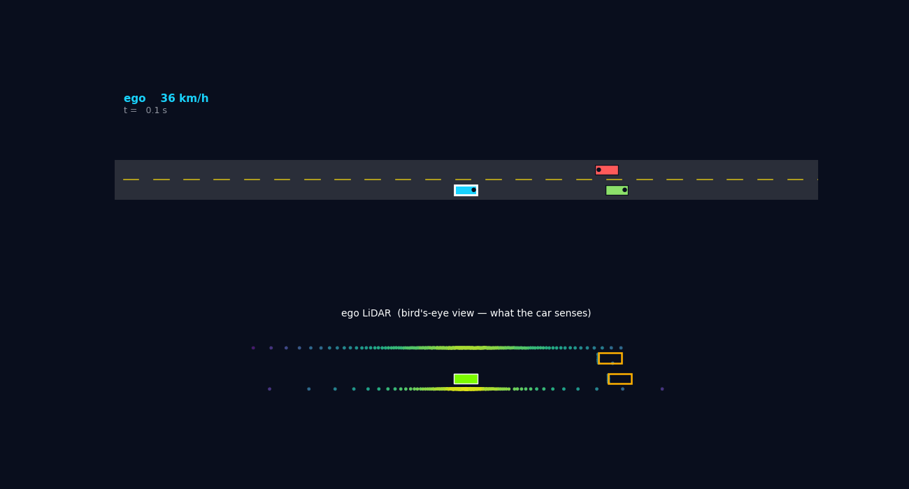
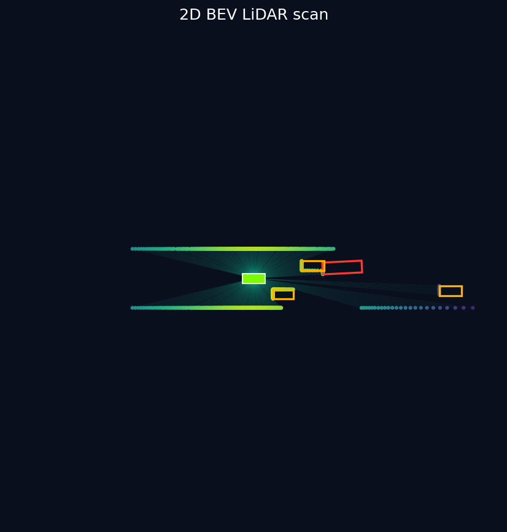

# BEV LiDAR + Traffic Simulator

A from-scratch autonomous-driving sandbox in two parts:

1. **A 2D bird's-eye-view LiDAR sensor** — a spinning sensor fires rays in a
   full 360° circle against a scene of 2D polygons; each ray stops at the first
   surface it hits, so occlusion and shadows fall out for free.
2. **A live rule-following traffic microsimulator** — an ego car drives down a
   road, obeys traffic lights and a stop sign, keeps distance to the car ahead,
   and reacts to vehicles entering and leaving the road. The ego's LiDAR view
   is rendered live below the road so you can see what the car senses.



## Run the driving sim

```bash
python drive.py              # live window: chase cam + ego LiDAR strip
python drive.py --no-lidar   # road view only
python drive.py --save out.gif --seconds 12   # headless render to a GIF
```

## Run just the LiDAR sensor



## Why this is relevant to autonomous driving

Bird's-eye view is the working representation of modern AV perception:
detectors like PointPillars rasterize LiDAR into a top-down grid before running
a CNN. This project builds that world from the sensor up.

## Setup

```bash
python -m venv .venv && source .venv/bin/activate
pip install -r requirements.txt
```

## Run

```bash
python demo.py              # single frame  -> bev_frame.png
python demo.py --rays       # single frame with laser rays drawn
python demo.py --animate    # moving scene  -> bev_scan.gif
```

## Files

| File | Role |
|------|------|
| `scene.py` | `Box` (oriented rectangle) + `Scene`; converts everything to line segments |
| `lidar.py` | `Lidar2D` — vectorized ray/segment intersection, nearest-hit per beam |
| `viz.py`   | Matplotlib BEV rendering (points colored by range, ego, GT boxes) |
| `demo.py`  | Static LiDAR demo: builds a scene, scans it, renders a still or animation |
| `sim.py`   | Traffic microsim: IDM car-following, traffic lights, stop signs, spawning |
| `render.py`| Chase-cam road view + ego LiDAR strip |
| `drive.py` | Live driving simulation entry point |

## How the driving behaves

Every vehicle drives with the **Intelligent Driver Model (IDM)**, the standard
car-following model: it accelerates toward a desired speed and brakes to keep a
safe, speed-dependent gap to whatever is ahead. Traffic lights and stop signs
are handled the way real microsimulators do it — a red light or an un-cleared
stop line becomes a *virtual stopped car* at the stop line, so the same IDM
code that follows the lead vehicle also brings the car to a smooth stop at a
signal. A stop sign additionally requires a full halt (v ≈ 0) before the car
marks it cleared and proceeds.

## How the sensor works

Each beam is a ray `O + t·d`. For a segment `A → B` we solve for the ray
parameter `t` and segment parameter `u` with 2D cross products:

```
t = (A − O) × e / (d × e)      u = (A − O) × d / (d × e)      e = B − A
```

A hit is valid when `t > 0` and `0 ≤ u ≤ 1`; the smallest valid `t` across all
segments is the measured range. All beams × all segments are computed in one
broadcast, so a full sweep is a couple of numpy operations.

## Ideas to extend

- Rasterize hits into a **BEV occupancy grid** (the input format a BEV detector eats)
- Train a small **detector/segmenter** on the free ground-truth boxes (sim-to-real)
- Add an **intensity channel** (per-surface reflectivity) and richer sensor noise
- Drive the **ego along a path** and accumulate scans into a map (mini-SLAM)
